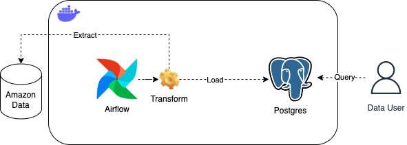
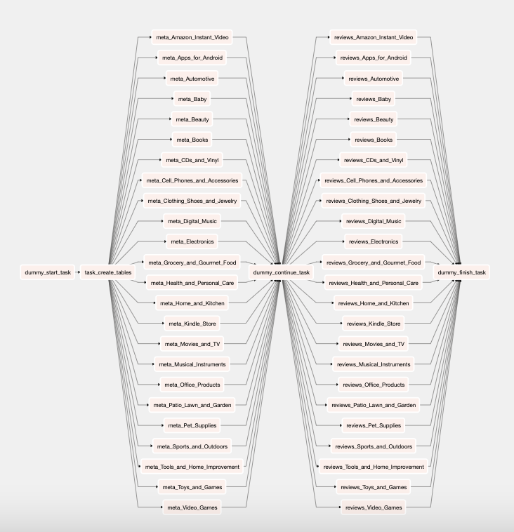
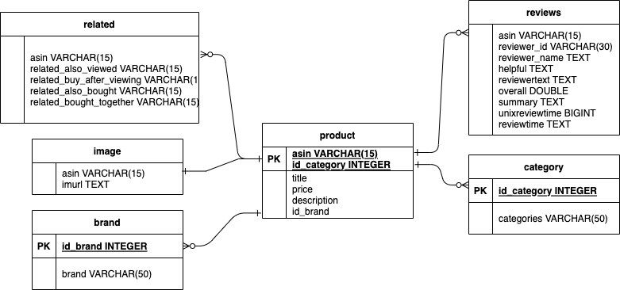

# Data Pipeline using Airflow

[](https://github.com/psf/black)

## About this repository
This project create a pipeline workflow for extracting data from the JSON files, transform it into a dimensional
model and importing it into a Postgres database.
The data used for this pipeline can be founded [here](http://jmcauley.ucsd.edu/data/amazon/links.html)

### Code Styling and flint
In order to maintain code quality this repository uses [flake8](https://flake8.pycqa.org/en/latest/) and [black](https://black.readthedocs.io/en/stable/the_black_code_style/current_style.html) for code style and flinting

## Architecture
This project uses Airflow to orchestrate the pipeline and a Postgres database to persist the data after treatments.

To build the needed containers this project uses [docker sdk python](https://github.com/docker/docker-py) to handle Airflow and Postgres images



## Getting started

### Prerequisites

### Python
This service uses Python version 3.8. To download and install the version got to the python page [here](https://www.python.org/downloads/).

### Docker
To handle Airflow and Postgres images this service uses Docker. To download and install visit the docker page [here](https://www.docker.com/products/docker-desktop/).

## Running the services
After cloning this repository just type `make` on the root folder, the Makefile will install all dependencies that you need and build the containers.

On your browser type `http://localhost:8080/` to get access to Airflow UI, the user and password is `airflow`

### The DAG
The only dag that will appear is `amazon_data_pipeline`, this DAG extract the JSON files from [Amazon Product Data](http://jmcauley.ucsd.edu/data/amazon/links.html), transform the JSON files into dataframes, make the transformations and load into Postgres in a dimensional model.
First the DAG create all necessary tables, after that extract the `meta` file for every category, transform into a dimensional model and load in the database, finally the DAG extract the `reviews` file for every category and load in the database.
In order to speed up execution, the DAG has been split into two parts and execute all categories asynchronously.



### The dimensional model
After the data treatments, the database has this architecture.



To get access and query the data use this credentials:
```
"host": "localhost"
"port": 5432
"database": "database"
"username": "user"
"password": "password"
```

